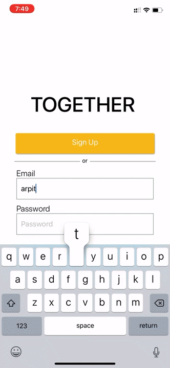

# Transform
In India , most of the public transport that people use is privately owned, there are thousands of rickshaw and shuttle owners, and because they are privately owned they are highly decentralized, there are unions of rickshaw owner but they do not include larger member than that belong to a city , because of this decentralization , no one knows outside of the city about these privately regulated it is much - much harder for a someone outside of a region to use a public transport of other region, we find that one of the major reason people don't use public transport is because they don't know that it exist. Even within a city people only knows some routes and if they want to go someplace new they usually don't use public transport as they don’t know about it
we come up with is to somewhat organize this highly decentralized system, we want to build on top of what is already there, First of our steps is to make people aware about these public transport systems , second we want to make a  single place to buy ticket from that will be accepted by anyone and acknowledged by everyone, We want to make the use of public transport as simple as booking an uber

## Description
This repo contains the rider mobile allication build using React.Native for driver's application visit [Driver's app](https://github.com/pranavpandey1998official/transformDrive)

## Images
<table> 
  <tr>
    <td></td>
    <td></td>
    <td></td>
    <td></td>
  </tr>
  <tr>
    <td></td>
    <td></td>
    <td></td>
    <td></td>
  </tr>
  <tr>
    <td></td>
  </tr>
</table>  

## Gif showing working of app
<tr>
    <td></td>
    <td></td>
</tr>

### ticket booking
</td>

## Reporting an Issue
Github Issues are used to track todos, bugs, feature requests, and more.

## Contributing
Are you a dev and would like to help? Found a bug that you would like to report or a missing feature that you would like to work on? Great! open a pull request .

Development
- You need Node & Yarn to start the development environment. Download them here - Node, Yarn
- Run the development server using:

```bash
yarn

yarn android
```

